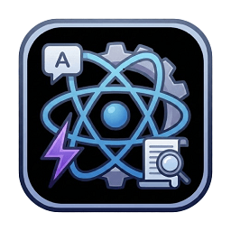

# React Dev Assistant for VS Code

React Dev Assistant is a powerful VS Code extension designed to streamline the workflow of React developers. It automates bootstrapping, script management, and code quality tracking, allowing you to focus on building features rather than configuration.



## 🚀 Features

### 1. Project Bootstrapping Assistant

Create new React applications effortlessly using **Vite**.

- **Command:** `Create React Project`
- GUI-based Wizard (No more memorizing CLI commands).
- Supports `npm`, `yarn`, and `pnpm`.
- Auto-validates project names and folder availability.
- Option to initialize Git and install dependencies automatically.

### 2. Script Runner

Stop searching through `package.json` to remember script names.

- **Command:** `Run Script Assistant`
- Auto-detects scripts in your workspace.
- Provides a clickable menu to Run, Debug, or Copy scripts.
- **Smart Execution:** Detects if you need `cross-env` or `bash` for Windows compatibility.

### 3. Annotation Manager (TODO/FIXME Items)

Keep track of technical debt directly in your editor.

- Scans workspace for `TODO`, `FIXME`, `BUG`, `NOTE`, etc.
- **Tree View:** View all annotations grouped by file in the Sidebar.
- **Highlighter:** Visual cues in the editor gutter for active TODOs.
- Customizable highlight colors and tags via settings.

### 4. Documentation Hub

Instant access to essential React ecosystem documentation.

- **Command:** `Open Documentation Hub`
- Quick links to React Docs, Vite, ESLint, React Testing Library, and more.

## ⚙️ Extension Settings

| Setting                          | Description                                    | Default             |
| :------------------------------- | :--------------------------------------------- | :------------------ |
| `todo.highlightColor`            | Color of the border for TODO items             | `#FFCC00`           |
| `todo.customTags`                | Array of tags to scan (e.g., "HACK", "REVIEW") | `["TODO", "FIXME"]` |
| `bootstrappingAssistant.gitInit` | Auto-initialize Git on new projects            | `true`              |

## 🔧 Requirements

- VS Code v1.75+
- Node.js installed on your system (for running scripts/bootstrapping).

## 📂 Project Structure

The extension follows a modular feature-based architecture. The source code is located in the `src` folder, organized as follows:

```text
react-dev-assistant/
├── src/
│   ├── features/                 # Core functionality modules
│   │   ├── annotations/          # Logic for TODO/FIXME scanning & tree view
│   │   ├── bootstrapping/        # Logic for creating new React projects (Vite wrapper)
│   │   ├── documentation-access/ # Logic for the Documentation Hub & links
│   │   └── script-assistant/     # Logic for parsing and running package.json scripts
│   ├── utils/                    # Shared helper functions and types
│   ├── test/                     # Unit and integration tests
│   └── extension.ts              # Extension entry point (activates modules)
├── media/                        # Icons and static assets
├── package.json                  # Extension manifest and dependencies
└── tsconfig.json                 # TypeScript configuration

This structure ensures that each feature is self-contained, making the codebase easier to maintain and scale.

## 📅 Release Notes

### 0.0.1

**Initial Release**

Introducing React Dev Assistant with core features to enhance your React development workflow:

- **Project Bootstrapping Assistant** - Streamlined React project creation with Vite
- **Script Runner** - Intelligent script detection and execution from `package.json`
- **Annotation Manager** - TODO/FIXME tracking with visual highlighting
- **Documentation Hub** - Quick access to essential React ecosystem resources

---

**Get started today and simplify your React development process!**
```
